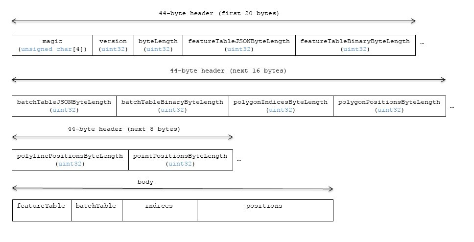
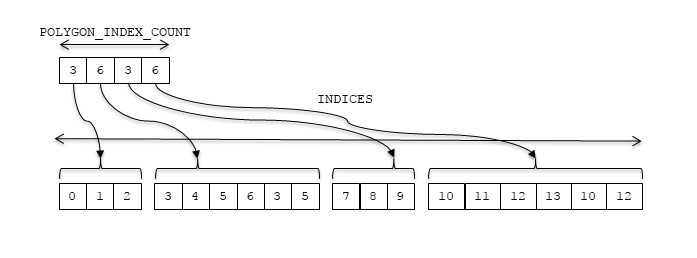

# Vector Data

## Contributors

* Dan Bagnell, [@bagnell](https://github.com/bagnell)
* Rob Taglang, [@lasalvavida](https://github.com/lasalvavida)
* Patrick Cozzi, [@pjcozzi](https://twitter.com/pjcozzi)

## Overview

The _Vector_ tile format allows streaming of vector datasets including points, polylines, and polygons.  Points can be represented with a combination of billboard, label, and point graphics primitives.

Each point, poyline, and polygon is a _feature_ in the 3D Tiles specification language. 

## Layout

A tile is composed of two sections: a header immediately followed by a body.

**Figure1**: Vector tile layout.


## Header

The 28-byte header contains the following fields:

| Field name | Data type | Description |
| --- | --- | --- |
| `magic` | 4-byte ANSI string | `"vctr"`. This can be used to identify the arraybuffer as a Vector tile. |
| `version` | `uint32` | The version of the Vector Data format. It is currently `1`. |
| `byteLength` | `uint32` | The length of the entire tile, including the header, in bytes. |
| `featureTableJSONByteLength` | `uint32` | The length of the feature table JSON section in bytes. |
| `featureTableBinaryByteLength` | `uint32` | The length of the feature table binary section in bytes. If `featureTableJSONByteLength` is zero, this will also be zero. |
| `batchTableJSONByteLength` | `uint32` | The length of the batch table JSON section in bytes. Zero indicates that there is no batch table. |
| `batchTableBinaryByteLength` | `uint32` | The length of the batch table binary section in bytes. If `batchTableJSONByteLength` is zero, this will also be zero. | 
| `indicesByteLength` | `uint32` | The length of the polygon indices buffer. |
| `polygonPositionsByteLength` | `uint32` | The length of the polygon positions buffer. |
| `polylinePositionsByteLength` | `uint32` | The length of the polyline positions buffer. |
| `pointPositionsByteLength` | `uint32` | The length of the point positions buffer. |

If `featureTableJSONByteLength` equals zero, the tile does not need to be rendered.

The body section immediately follows the header section, and is composed of four fields: `Feature Table`, `Batch Table`, `Indices`, and `Positions`.

Code for reading the header can be found in
[Vector3DModelTileContent.js](https://github.com/AnalyticalGraphicsInc/cesium/blob/vector-tiles/Source/Scene/Vector3DTileContent.js)
in the Cesium implementation of 3D Tiles.

## Feature Table

Contains values for `vctr` semantics used to render features.  The general layout of a Feature Table is described in the [Feature Table specification](../FeatureTable).

The `vctr` Feature Table JSON schema is defined in [vctr.featureTable.schema.json](../../schema/vctr.featureTable.schema.json).

### Semantics

If a semantic has a dependency on another semantic, that semantic must be defined as well.
Per-feature semantics specific to a feature type are prefixed with the name of the feature type. e.g. `POLYGON` for polygons, `POLYLINE` for polylines and `POINT` for points.

At least one global `LENGTH` semantic must be defined. 
If `POLYGONS_LENGTH` is not defined, or zero, no polygons will be rendered. 
If `POLYLINES_LENGTH` is not defined, or zero, no polylines will be rendered.
If `POINTS_LENGTH` is not defined, or zero, no points will be rendered.
Multiple feature types may be defined in a single Vector tile using multiple `LENGTH` semantics, and in that case, all specified feature types will be rendered.

#### Global Semantics

The semantics define global properties for all vector elements.

| Semantic | Data Type | Description | Required |
| --- | --- | --- | --- |
| `POLYGONS_LENGTH` | `uint32` | The number of polygons in the tile. | :white_check_mark: Yes, unless one of `POLYLINES_LENGTH` or `POINTS_LENGTH` is defined. |
| `POLYLINES_LENGTH` | `uint32` | The number of polylines in the tile. | :white_check_mark: Yes, unless one of `POLYGONS_LENGTH` or `POINTS_LENGTH` is defined.  |
| `POINTS_LENGTH` | `uint32` | The number of points in the tile. | :white_check_mark: Yes, unless one of `POLYGONS_LENGTH` or `POLYLINES_LENGTH` is defined.  |
| `MINIMUM_HEIGHT` | `float32` | The minimum terrain height for this tiles' region in meters above the WGS84 ellipsoid. | :white_check_mark: Yes. |
| `MAXIMUM_HEIGHT` | `float32` | The maximum terrain height for this tiles' region in meters above the WGS84 ellipsoid. | :white_check_mark: Yes. |

#### Vector Semantics

| Semantic | Data Type | Description | Required |
| --- | --- | --- | --- |
| `POLYGON_COUNT` | `uint32` | The number of points that belong to each polygon. This refers to the polygon section of the positions buffer in the body. Each polygon count refers to a contiguous number of points in the position buffer that represents the polygon.  | :white_check_mark: Yes, unless `POLYGONS_LENGTH` is zero or not defined. |
| `POLYGON_INDEX_COUNT` | `uint32` | The number of indices that belong to each polygon. This refers to the indices buffer of the body. Each index count refers to a contiguous number of indices that represent the triangulated polygon. | :white_check_mark: Yes, unless `POLYGONS_LENGTH` is zero or not defined. |
| `POLYGON_MINIMUM_HEIGHT` | `float32` | The minimum height of each polygon. | :red_circle: No. If the minimum height for each polygon is not specified, the global `MINIMUM_HEIGHT` will be used. |
| `POLYGON_MAXIMUM_HEIGHT` | `float32` | The maximum height of each polygon. | :red_cricle: No. If the maximum height for each polygon is not specified, the global `MAXIMUM_HEIGHT` will be used. |
| `POLYGON_BATCH_ID` | `uint16` | The `batchId` of the polygon that can be used to retrieve metadata from the `Batch Table`. | :red_circle: No. |
| `POLYLINE_COUNT` | `uint32` | The number of points that belong to each polyline. This refers to the polyline section of the positions buffer in the body. Each polyline count refers to a contiguous number of points in the position buffer that represents the polyline. Each point is the start of a segment of the polyline with the next being the end of the segment. | :white_check_mark: Yes, unless `POLYLINES_LENGTH` is not defined. |
| `POLYLINE_BATCH_ID` | `uint16` | The `batchId` of the polyline that can be used to retrieve metadata from the `Batch Table`. | :red_circle: No. |
| `POINT_BATCH_ID` | `uint16` | The `batchId` of the point that can be used to retrieve metadata from the `Batch Table`. | :red_circle: No. |

## Batch Table

Contains metadata organized by `batchId` that can be used for declarative styling. See the [Batch Table specification](../BatchTable) reference for more information.

### Indices

TODO: `uint16` indices.

The indices are a buffer of `uint32` values. The byte length is given by `indicesByteLength` in the header. Each count in `POLYGON_INDEX_COUNT` represents a contiguous section of the array that represents a triangulated polygon. 
For example, let the first two polygons have 6 and 12 for their index counts. The first polygon has 6 indices starting at byte offset `0` and ending at byte offset `6 * byteSize - 1`.
The second polygon has 12 indices starting at byte offset `6 * byteSize` and ending at `6 * byteSize + 12 * byteSize`.

**Figure 2**: Example index buffer.



The number of indices must be a multiple of three. Each consecutive list of three indices is a triangle that must be ordered counter-clockwise. Each index is from the start of the buffer, **NOT** from the offset of the first position of the polygon.

### Positions

The positions buffer contains up to three sub-buffers for the polygons, polylines and points. The positions are encoded according to the quantized-mesh-1.0 format[1].

The bounding volume for the tile must be a tile bounding region containing the north, south, east, and west bounds of the tile. The positions are represented by u, v, and height values that are quantized and delta encoded.

| Field | Meaning |
| --- | --- |
| u | The horizontal coordinate of the vertex in the tile. When the u value is 0, the vertex is on the Western edge of the tile. Then the value is 32767, the vertex is on the Eastern edge of the tile. For other values, the vertex's longitude is a linear interpolation between the longitudes of the Western and Eastern edges of the tile. |
| v | The vertical coordinate of the vertex in the tile. When the v value is 0, the vertex is on the Southern edge of the tile. When the value is 32767, the vertex is on the Northern edge of the tile. For other values, the vertex's latitude is a linear interpolation between the latitudes of the Southern and Northern edges of the tile. |
| height | The height of the vertex of the tile. When the height value is 0, the vertex's height is equal to `MINIMUM_HEIGHT` from the feature table. When the value is 32767, the vertex's height is equal to `MAXIMUM_HEIGHT` from the feature table. For other values, the vertex's height is a linear interpolation of the minimum and maximum heights. |

The values are then delta and ZigZag encoded. The delta encoding ensures the values are small integers. The ZigZag encoding ensure the values are positive integers. Example encoding code is listed below:
```javascript
function zigZag(value) {
    return ((value << 1) ^ (value >> 15)) & 0xFFFF;
}

var lastU = 0;
var lastV = 0;
var lastHeight = 0;

for (var i = 0; i < length; ++i) {
    var u = uBuffer[i];
    var v = vBuffer[i];
    var height = heightBuffer[i];
    
    uBuffer[i] = zigZag(u - lastU);
    vBuffer[i] = zigZag(v - lastV);
    heightBuffer = zigZag(height - lastHeight);

    lastU = u;
    lastV = v;
    lastHeight = height;
}
```

Example decoding code is listed below:
```javascript
function zigZagDecode(value) {
    return (value >> 1) ^ (-(value & 1));
}

var u = 0;
var v = 0;
var height = 0;

for (var i = 0; i < length; ++i) {
    u += zigZagDecode(uBuffer[i]);
    v += zigZagDecode(vBuffer[i]);
    height += zigZagDecode(heightBuffer[i]);
    
    uBuffer[i] = u;
    vBuffer[i] = v;
    heightBuffer[i] = height;
}
```

#### Polygon positions

The first section of the positions buffer, from offset 0 to `polygonPositionsByteLength`, contains the polygon positions. Polygon positions only have u and v values. The u values are from offset `0` to `polygonPositionsByteLength / 2`. The v values are from offset `polygonPositionsByteLength /2` to `polygonPositionsByteLength`. The number of positions for each polygon is determined by the value of its `POLYGON_COUNT`. 
For example, let the first polygon count be 5. The first polygons u values start at offset `0` and end at `5 * byteSize`. Its v values start at `polygonPositionsByteLength / 2` and end at `polygonPositionsByteLength / 2 + 5 * byteSize`.

The positions of the polygons must be the outer ring positions listed in counter-clockwise order.

TODO: polygons with holes?

#### Polyline positions

Polyline positions follow immediatley after the polygon positions. They start at `polygonPositionsByteLength` and end at `polygonPositionsByteLength + polylinePositionsByteLength`. The polyline positions are similar to polygon positions, but they also contain height values. The u values are from offset `0` to `polylinePositionsByteLength / 3`. The v values are from offset `polylinePositionsByteLength / 3` to `2 * polygonPositionsByteLength / 3`. The height values are from offset `2 * polylinePositionsByteLength / 3` to `polygonPositionsByteLength`. The number of positions for each polyline is determined by the value of its `POLYLINE_COUNT`. 
From the first point on the polyline, each successive point creates a segment connected to the previous.

#### Point positions

Point positions follow immediatley after the polyline positions. They start at `polygonPositionsByteLength + polylinePositionByteLength` and end at `polygonPositionsByteLength + polylinePositionByteLength + pointPositionsByteLength`. Point positions have the exact same layout as polyline positions.
Each `u, v, height` triple is a single point.

## File Extension

`.vctr`

The file extension is optional. Valid implementations ignore it and identify a content's format by the `magic` field in its header.

## MIME Type

_TODO, [#60](https://github.com/AnalyticalGraphicsInc/3d-tiles/issues/60)_

`application/octet-stream`
 
## Resources
1. [quantized-mesh-1.0 terrain format](https://cesiumjs.org/data-and-assets/terrain/formats/quantized-mesh-1.0.html)
